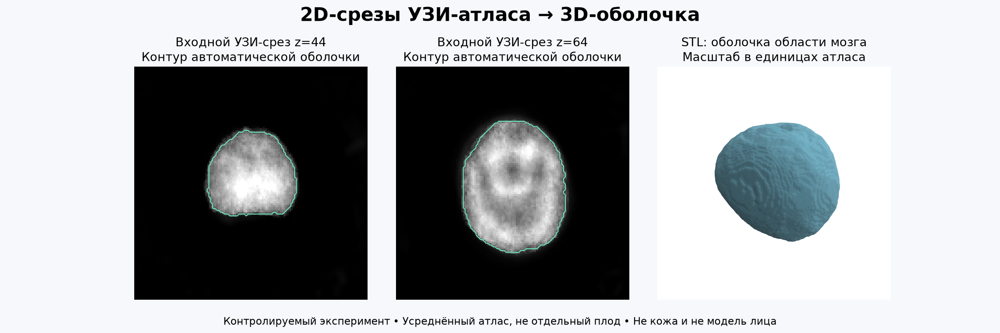
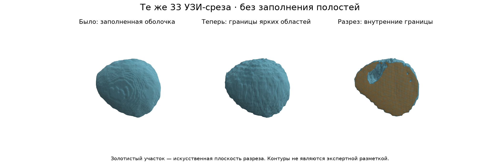

# Краткий отчёт: из 2D УЗИ в STL

## Что хотелось сделать

Цель проекта — показать, как из нескольких двумерных УЗИ-срезов получить объёмную модель, которую можно открыть в STL-просмотрщике.

В результате получены три варианта:

- `outputs/embryonic_brain_envelope.stl` — простая внешняя оболочка;
- `outputs/details/brain_intensity_surface.stl` — поверхность с внутренними границами;
- `outputs/details/brain_cutaway.stl` — разрез модели для просмотра внутри.

## Какие данные использовались

Источник — [The 4D Human Embryonic Brain Atlas](https://doi.org/10.5281/zenodo.10549081). Это усреднённый атлас, созданный из 3D УЗИ первого триместра. В работе использован файл `atlas_56.nii.gz` размером 128 × 128 × 128.

Из него были сохранены 33 отдельных 2D-среза: `z = 0, 4, 8, …, 124, 127`. Они лежат в `data/slices_step4/`. Координаты срезов записаны в `manifest.json`.

Это удобный контролируемый пример: положение каждой плоскости известно, а полный объём можно использовать для проверки. Но это не набор обычных фотографий УЗИ одного пациента.

## Как строилась модель

Промежуточные срезы восстанавливаются линейной интерполяцией:

`I(z) = (1−t) · I(z₀) + t · I(z₁)`.

Дальше программа:

1. немного сглаживает объём;
2. находит порог Оцу;
3. оставляет крупнейшую яркую область;
4. строит поверхность методом Marching Cubes;
5. сохраняет результат в STL;
6. повторно открывает STL и проверяет его геометрию.

Нейросеть здесь не использовалась: при известных координатах параллельных срезов достаточно обычной интерполяции и методов компьютерного зрения.

## Что получилось

Основная модель:

- 33 входных среза;
- объём 128 × 128 × 128;
- 20 156 вершин и 40 308 треугольников;
- одна связная и замкнутая поверхность;
- примерные габариты 56 × 73 × 66 единиц атласа.

Для проверки 95 промежуточных срезов не подавались на вход. На них линейная интерполяция оказалась лучше копирования ближайшего среза:

| Метрика | Ближайший срез | Линейная интерполяция |
|---|---:|---:|
| RMSE | 0.012485 | 0.007848 |
| Средний SSIM | 0.970116 | 0.980763 |

Эта проверка показывает, что интерполяция хорошо восстанавливает именно данный гладкий атлас. Она не подтверждает медицинскую точность на новых пациентах.

## Вариант с внутренними границами

Первая версия заполняла полости и выглядела слишком просто. Поэтому был добавлен второй вариант: сглаживание уменьшено, заполнение полостей отключено, а поверхность строится прямо по интенсивности.

| Файл | Что внутри | Треугольников |
|---|---|---:|
| `brain_intensity_surface.stl` | Полная поверхность с внутренними границами | 48 060 |
| `brain_cutaway.stl` | Половина модели с закрытой плоскостью разреза | 30 224 |

Золотистая часть на картинке — искусственно закрытая плоскость разреза, а не анатомическая структура.

## Что не получилось

- Не восстановлены лицо, кожа, череп или целый эмбрион.
- Нет экспертной разметки, поэтому поверхность нельзя считать точной границей мозга.
- Не восстанавливалось движение УЗИ-датчика.
- Нельзя обработать произвольное видео без координат и ориентации кадров.
- Масштаб атласа неизвестен, поэтому размеры STL нельзя уверенно считать миллиметрами.

Модель лучше называть приближённой изоповерхностью области эмбриональной головы/мозга, а не точной анатомической моделью.

## Похожие работы

- [ImplicitVol](https://arxiv.org/abs/2109.12108) — восстановление объёма по 2D-срезам с уточнением их положения; [код](https://github.com/pakheiyeung/ImplicitVol).
- [RapidVol](https://arxiv.org/abs/2404.10766) — быстрая реконструкция 3D УЗИ мозга плода.
- [FetusMapV2](https://arxiv.org/abs/2310.19293) — оценка положения частей плода в 3D УЗИ.
- [TUS-REC2025](https://github.com/QiLi111/TUS-REC2025-Challenge_baseline) — открытый пример реконструкции freehand УЗИ без трекера.
- [Marching Cubes](https://scikit-image.org/docs/stable/api/skimage.measure.html#skimage.measure.marching_cubes) — алгоритм, использованный для построения STL-поверхности.

## Итог

Техническая часть работает, модели открываются и проходят проверку геометрии. Главный недостаток — использование срезов готового атласа с известным положением, поэтому работа не решает полную задачу реконструкции конкретного эмбриона по обычным 2D-снимкам.
